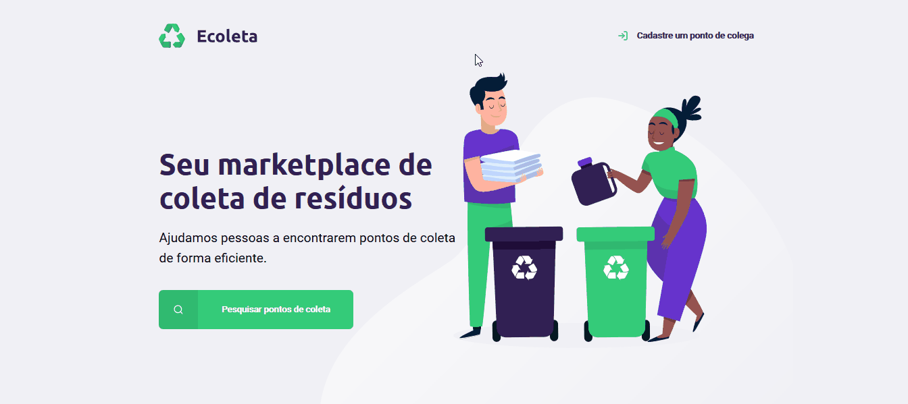

# 1ª Next Level Week - [Rocketseat](https://rocketseat.com.br/)

## Objetivo do projeto:
- Desenvolver uma aplicação web;
- Apresentar e aplicar os conceitos de HTML, CSS, JavaScript, Node e SQLite3.

---
## Descrição do projeto:

O projeto é Ecoleta visa ajudar o usuário a encontrar pontos de coleta de resíduos adequados para cada tipo de material. O usuário pode pesquisar certa cidade no campo de busca, entidades que
façam a coleta desses resíduos dos quais ela queria fazer o 
descarte de maneira adequada.

Através de uma aplicação web certa Entidade pode cadastrar pontos de coleta que contem informações como, nome, cidade, o tipo de
material reciclável que essa entidade recolhe, entre outras informações.

---
## Breve funcionamento da aplicação:

